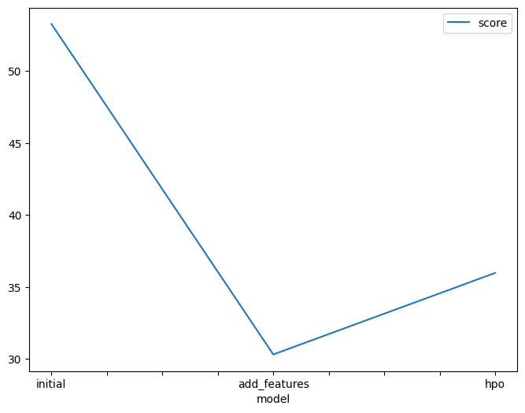
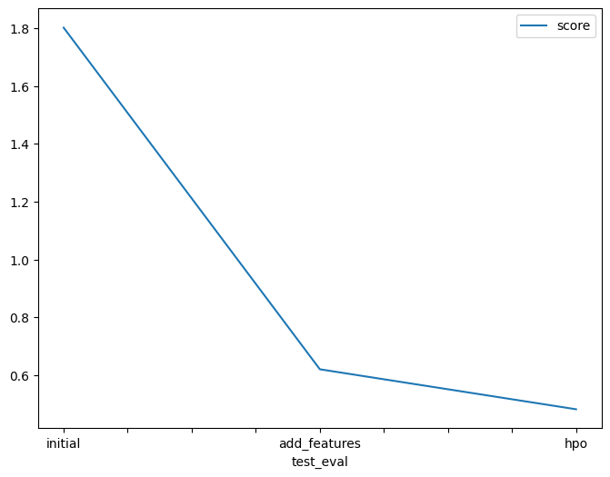

# Report: Predict Bike Sharing Demand with AutoGluon Solution
#### Rhea Mewadhari

## Initial Training
### What did you realize when you tried to submit your predictions? What changes were needed to the output of the predictor to submit your results?
Well first of all I needed to look at the resulting dataframe. After inspecting prediction, it became noticable that there were negative values in the predictions. I needed to filter through them and identify where the values where negative, once found I imputed them with the value of 0.

### What was the top ranked model that performed?
My best model was the hpo_model. This is due to the combination of feature engineering (one-hot encoding weather, etc.) as well as adding hyperparamters such as XGB and NN_Torch.

## Exploratory data analysis and feature creation
### What did the exploratory analysis find and how did you add additional features?
EDA was utilised to get familiar with the date. Through it I was able to identify season and weather as categories and convert them to be so. The display of the features through the histogram was also great for familiarising myself with the data points in the dataset such that I noticed that the most frequent feature wind speed was and the least frequent feature was holiday.
### How much better did your model preform after adding additional features and why do you think that is?
The model performed much better with a score of 30.305488. I beleive this is due to the fact that there were more features for the model to learn from leading to better learning the pattern.

## Hyper parameter tuning
### How much better did your model preform after trying different hyper parameters?
This also improved the performance from the initial model, but not as good as the new features model with a score of 35.972185. I would say this is because adding more hyperparamters increased the complexity of the model which lead to a bit of overfitting.

### If you were given more time with this dataset, where do you think you would spend more time?
I would have liked to spend more time on visualizing the dataset. I like to to tell stories with my dataset and enjoy a good visualization that allows you to capture the most relevant features about a dataset with just a glance.

### Create a table with the models you ran, the hyperparameters modified, and the kaggle score.
|model|presets|timelimit|hp-method|score|
|--|--|--|--|--|
|initial|"presets='best_quality'|time_limit=600|none|1.80219 |
|add_features|"presets='best_quality'|time_limit=600|none|0.61993 |
|hpo|"presets='best_quality'|time_limit=600|tabular autogluon|0.48159|

### Create a line plot showing the top model score for the three (or more) training runs during the project.

### Create a line plot showing the top kaggle score for the three (or more) prediction submissions during the project.

## Summary
The above notebook was a great introduction to the AutoGluon framework. There were multiple options to train models and learn how to try out different parameters

The best performing model was the new features model with a RSME of 30.305488

After training the model using AutoGluon, the `fit_summary()` function was used to identify the best-performing model, which was `WeightedEnsemble_L3` with a root mean squared error (RMSE) of **-30.305488** on the validation set. This ensemble model combined predictions from high-performing base models such as `LightGBM_BAG_L2`, `LightGBMXT_BAG_L2`, and `CatBoost_BAG_L2`, each of which individually achieved RMSE values in the range of -30.5 to -31.1. The ensemble's ability to leverage the strengths of its components through weighted averaging led to superior overall performance. 

The next best performing model was the hpo model with a RSME of-35.972185

In this evaluation, the second training run using updated hyperparameter tuning settings focused on both LightGBM and neural network models (`NN_TORCH`), with explicitly defined search spaces for parameters like `learning_rate`, `activation`, and `layers`. The `fit_summary()` revealed that the best model was once again a weighted ensemble—specifically, `WeightedEnsemble_L3`—achieving a validation RMSE of **-35.972185**. This performance was slightly worse compared to the first run’s top model (`WeightedEnsemble_L3` with RMSE of **-30.305488**), suggesting that the new hyperparameter configurations did not lead to improved generalization. Interestingly, all the trained models in the second run were based on LightGBM variations, indicating that the neural network configurations may have either underperformed or were filtered out during model selection. The broader hyperparameter space, especially for neural networks (e.g., dropout probabilities ranging from 0.0 to 0.5, multiple activation functions, and varying layer depths), may have introduced too much variance or failed to converge within the limited time (`600 seconds`), ultimately impacting ensemble quality. In contrast, the first configuration, which yielded better performance, possibly benefited from more stable base models and a more optimized balance of complexity and generalization, particularly from LightGBM and CatBoost components. This comparison highlights that while hyperparameter tuning is essential, overly broad or insufficiently constrained search spaces—especially for sensitive models like neural networks—can sometimes degrade overall model performance when not carefully managed.

